이번 챕터에서는 현업에서 쓰이는 프로젝트의 진행방식을 알아보자.

1. Look at the big picture.
2. Get the data.
3. Discover and visualize the data to gain insights.
4. Prepare the data for ML algorithms.
5. Select a model and train it.
6. Fine-tune your model.
7. Present your solution.
8. Launch, monitor, and maintain your system.

## Working with Real Data

머신러닝은 실제 데이터를 사용해야함. 다행이도 데이터가 엄청많음. 가져다가 쓰면된다. 

* Popular open data repositories

	* UN Irvine ML Repository
	* Kaggle
	* Amazon's AWS datasets
	
* Meta portals ( they list open data repositories)

	* [http://dataportals.org/](http://dataportals.org/)
	* [http://opendatamonitor.eu/](http://opendatamonitor.eu/)
	* [http://quandl.com/](http://quandl.com/)
	
* Other pages listing many popular open data repositories

	* Wiki list of ML datasets
	* Quora.com question
	* Datasets subreddit

이번 장은 캘리포니아 집가격데이터를 사용한다. 이 데이터셋은 1990년 캘리포니아 인구조사기반으로 이루어져 있다. 

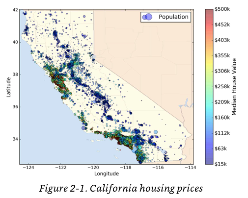

## Look at the Big Picture

먼저 이 데이터의 측정항목은 population, median income, median housing price, and so on for each block group in California 가 있다. Block group은 작은 지리적 단위이다. 
우리의 모델은 이 데이터로부터 학습을 해야한다. 그리고 집 가격에 대해서 중앙값을 얻어 예측한다.

#### Frame the Problem

회사의 사업 목적은 모델을 빌딩하는것이 최종목표가 아니다. 어떻게 이 모델로 이득을 내냐 문제이다. 
따라서 문제의 틀을 어떻게 결정하는지가 중요하다. 어떤 알고리즘을 선택하고 어떤 것 으로 측정하고 측정하는지 얼마나 많은 노력이 필요한지 등등.

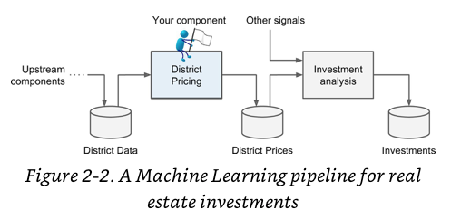

우리의 시스템을 디자인할 준비가 되었다면.

1. frame problem
	* supervised & unsupervised & Reinforcement Learning?
	* Classification task & regression task & something?
	* batch learning & online learning techniques?

이 질문들에 대해 답을 할 수 있어야 한다.

위의 예로 집 가격에 대한 데이터를 생각했을 떄는 
supervised learning 가 될것이다. 집 가격이 labeled 되어 있기 떄문에. 
또 regression task를 사용해야한다. 집 가격을 예상해야 하기 떄문에
multivariate regression가 가장 적합하다. 여러개 feature들이 있어서 예를들어 인구, 수입 등등 

첫번째 챕터에서 삶의 만족도를 하나의 feature로 사용했다. 이것은 univariate regression이였다. 

마지막으로 batch learning을 사용해야한다. 변화하는 데이터에 빠르게 적응할 필요가 없기 때문에 

#### Select a Performance Measure

다음은 성능 측정이다. regression problems에서는 Root Mean Square Error를 사용한다. *MSE라고 많이 부름* 실제 데이터와 예측데이터의 차이를 구하는 것이라고 생각하면 될꺼같다.

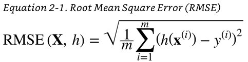

이 식을 보면 예측 데이터 에서 실제 데이터를 뺀후 제곱한다. 그 것을 모두 더하고 평균을 낸다. 

또 다른 것으로 Mean Absolute Error가 있다.

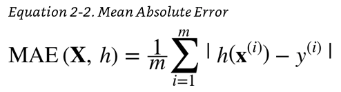

RMSE은 **norm2**의 하나의 종류인데 이 것의 정의는 실제 데이터와 예측데이터가 얼마나 친숙한지 나타낸다. 

MAE는 **norm1**의 종류이고 *Manhattan norm* 이라고 불린다. 

Ridge regression과 Lasso의 차이점에서도 볼수있는데 Ridge regression 은 norm2, Lasso는 norm1이다. 
이것처럼 normN에서 N이 높아질수록 **large values에 중점을 두고 small one은 방치를 한다.**

## Get the Data

Jupyter notebook으로 코드 예시를 든다.

#### Create the Workspace

처음 파이썬을 설치한다.
Workspace 폴더를 만들어 준비를한다. 
python module 설치한다 matplotlib, numpy, jupyter, pandas, scipy, sklearn 등등

#### Download the Data

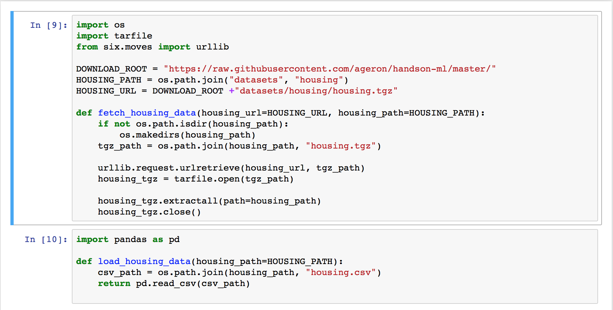

#### Take a Quick Look at the Data Structure

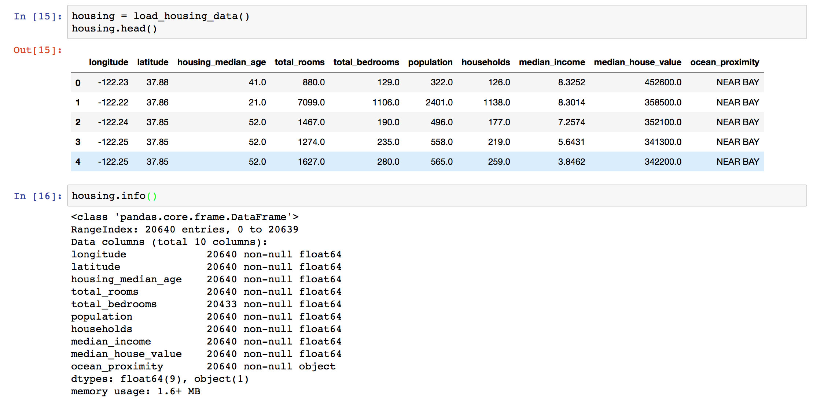

> $ head()

위에서 5개까지 볼수 있다. 사진에서 보면 총 10개의 attributes 가 있는걸 확인할 수 있다. 

> $ info()

데이터를 설명한다.

데이터가 대부분 20640개 인데 한가지 **total_bedrooms**만 20433개 이다. 

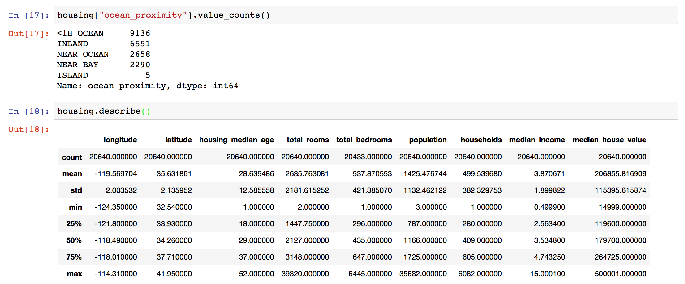

describe()는 numerical attributes를 요약해서 보여준다.

또 좋게 볼수 있는 방법은 histogram을 그리는 것이다. 

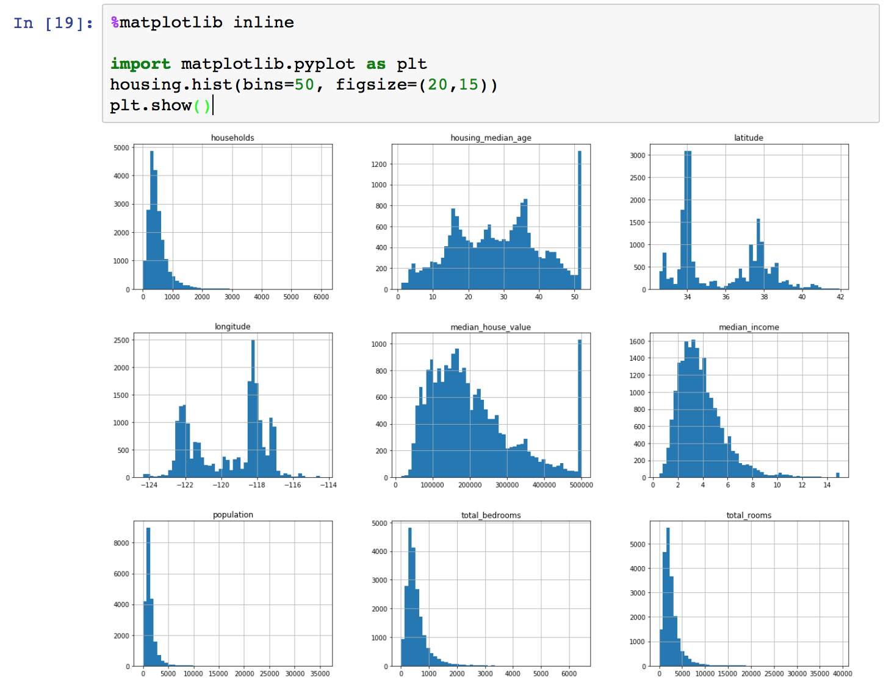

이 그래프에 대해서 잘 봐야할 부분이 있다.

1. 먼저 median income 의 예로 들어보면 15달러의 데이터는 15.00001 일수도 있고 0.4999 의 데이터 일수도 있는데 ML에서는 불필요한 문제이다. 어떻게 데이터가 계산되는지만 보면됨.
2. housing median age 그리고 median house value 에서 데이터가 확 띄는걸 볼수 있는데 이러한 데이터는 확인을 해봐야한다. 
	* 라벨링을 정확히 한다.
	* 데이터를 지워버린다
3. attributes가 규모가 다른것. 이건 이번 장에서 다룰것이다.
4. 히스토그램은 나중에 정규분포 모양으로 변환 시킬것이다.

#### Create a Test set

보통 20% dataset을 test set으로 만듬

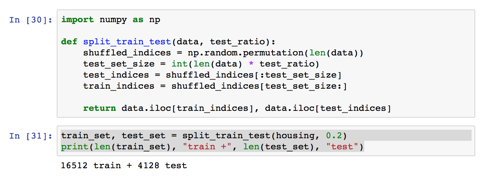

위의 코드를 다시 실행하면 결과가 다르게 나오는데 이는 컴퓨터가 랜덤으로 쓰는 seed값을 설정을 안해줘서 바뀔수 있다. 따라서 seed값을 설정준다.

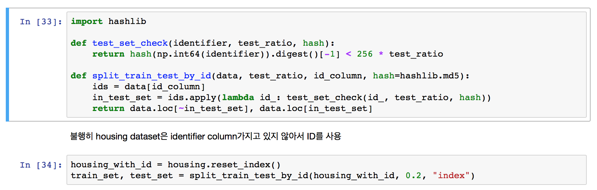

나중에 데이터가 업데이트 됐을때를 대비하여 hash값을 각 instance에 준다.

만약 row index를 만들면 unique identifier으로써 new data를 dataset끝에 둔다. 이게 불가능하면 좋은 features을 unique identifier로 쓴다. 

예를들어 위도와 경도는 엄청오래 보증된 데이터 이므로 이것을 연결해 ID같이 만든다.

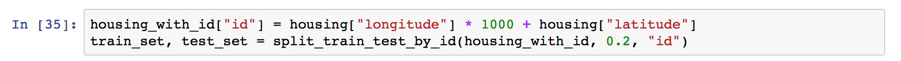

**Scikit-Learn**은 split datasets함수를 제공한다.  
먼저 random_state로 seed설정을 하고 동일한 행을가진 여러개의 datasets을 전달할수 있다. 

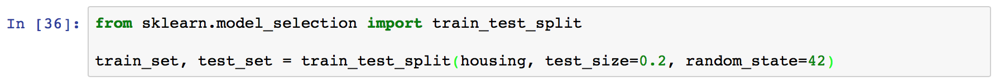

median income values 에서 $20000 - $50000 으로 군집되어 있는데 &60000을 뛰어 넘는것이 있다. 이 것을 정규 분포로 만들기 위해 1.5로 나눈다. 

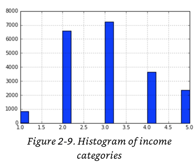

## Discover and Visualize the Data to Gain Insights 

test data는 냅두고 trainin data만 확인해본다 빠르고 쉽게 수행하기위해서 training data set을 샘플링 할 수 있다. 

#### Visualizing Geographical Data

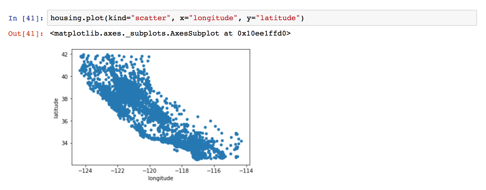

alpha 옵션을 0.1로 두면 고밀도 데이터의 포인트가 있는 곳을 쉽게 시각화 할 수 있다.

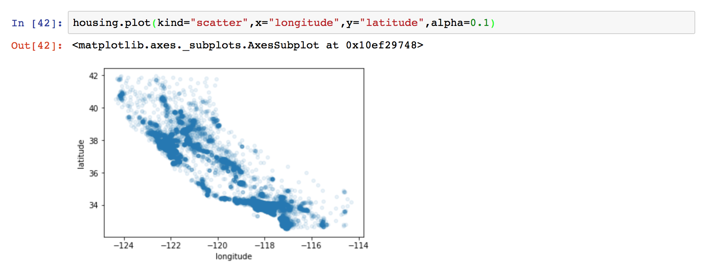

우리의 뇌는 패턴을 인식할 수 있지만 좀더 이쁘게 만들기 위해서 몇가지를 추가한다.   
각 원의 반경은 district's population을 의미한다. (option **S**)
색깔은 가격을 나타낸다. (option **C**)
color map을 나타낸다. (option **cmap**) called jet 작은것은 파란색 높은것을 빨간색으로.

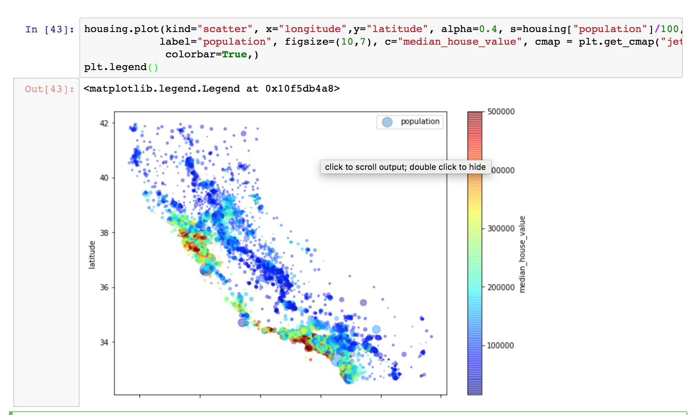

이 그림은 집 가격과 연관이 있다. 그리고 인구 밀집도에 
clustering algorithm을 이용하여 근접성을 측정하는 새로운 기능 추가가 유용할 것이다.

#### Looking for Correlations

Dataset이 크지않기 떄문에 쉽게 계산할 수 있다. corr()메소드를 사용해서 

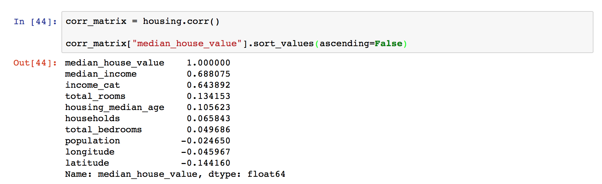

각 속성들의 상관관계를 나타냄

이 값들은 -1 부터 1 사이에 있는데 1에 가까울수록 긍정적인 상관관계를 의미한다. -1에 가까울수록 부정적인 상관관계를 의미

평균에 가까운 계수는 선형 상관관계가 아니다. 

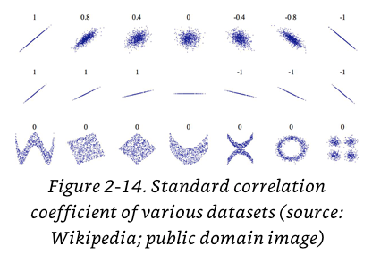

그림을 보면 수직축과 수평사이 계수 관계를 나타낸다. 

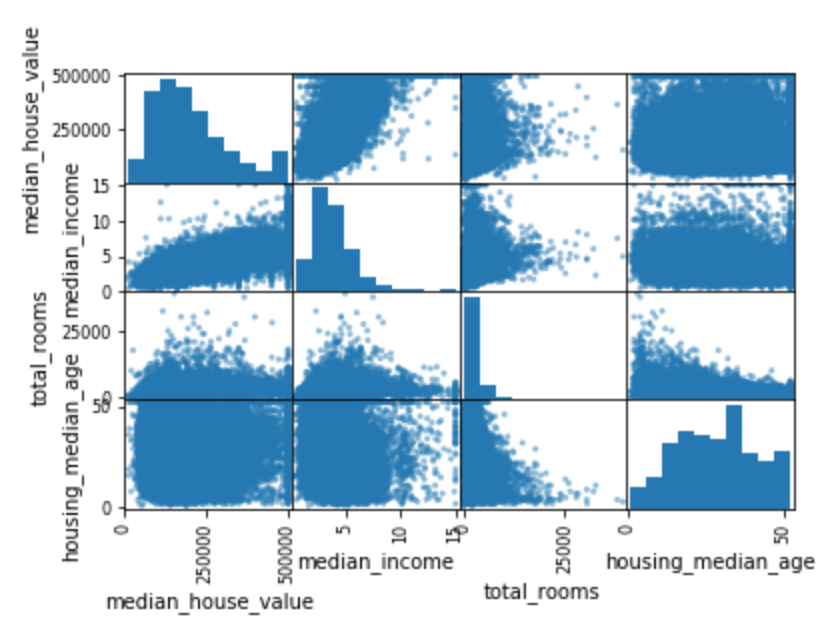

pandas 의 scatter_matrix 를 이용하면 속성들 사이관계를 다 보여준다 왼쪽위에서부터 오른쪽아래 대각선을 기준으로 위 아래가 대칭을 이룬다. pandas는 이 그래프에서 하나하나 추출 가능함. 

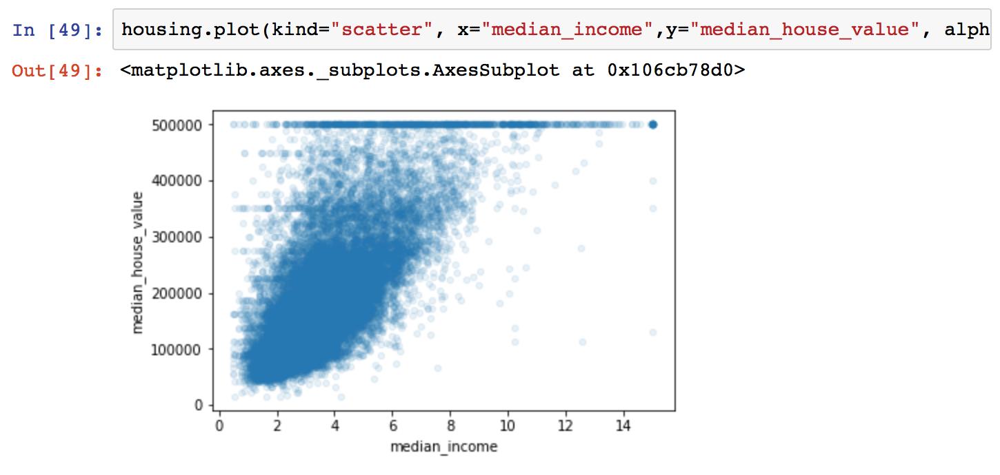

이 그래프를보면 위쪽 $500,000 에 수평선이 그어져 있는것을 확인할 수 있다. 그래프를 보고 이러한 단점을 배우지 못하게 할 수 있다.

#### Experimenting with Attribute Combinations

어떤 데이터의 이상을 식별했을때 ML algorithm으로 깨끗히 가공해 데이터를 넘겨준다. 그리고 속성 사이의 관계를 찾는다 또한 분포를 확인하고 원하는대로 변경했다. 프로젝트마다 다르겠지만 아이디어는 비슷하다. 
실제 ML algorithm에 대한 데이터를 준비하기 전에 할 일은 다양한 속성 조합이다. 

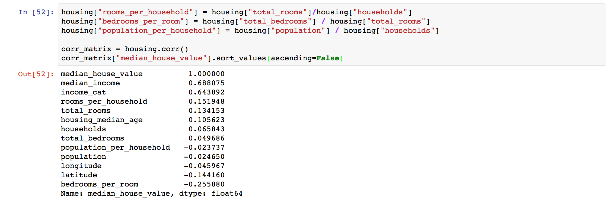

## Prepare the Data for ML Algorithms

데이터를 준비해야하는데 준비할때 사용하는 함수를 작성해야한다.

* 이렇게 하면 모든 데이터 세트에서 변형을 쉽게 재현할 수 있다.
* 향후 프로젝트에서 재사용 할 수있는 변형 함수 라이브러리를 점차적으로 구축한다.
* 라이브 시스템에서 이러한 함수를 사용하여 새 데이터를 알고리즘으로 보내기전에 변형 할 수 있다.
* 이렇게하면 다양한 변형을 하고 어떤 조합이 가장 잘 작동하는지 확인할 수 있다.

하지만 먼저 training set을 원래대로 돌리고 예측인자와 타겟 값데 동일한 변환을 반드시 적용할 필요가없으므로 예측 인자와 레이블을 분리한다.

#### Data Cleaning

대부분 ML 알고리즘은 features없이 일을 할 수 없으므로 이를 케어해줄 함수를 만든다. total_bedrooms 속성은 몇개의 값이 없다. 그래서 이를 고쳐줄 3개의 옵션을 갖는다.

* districts를 지운다.
* 전체 속성을 지운다.
* 0이나 평균이나 중간값같은 값으로 설정한다.

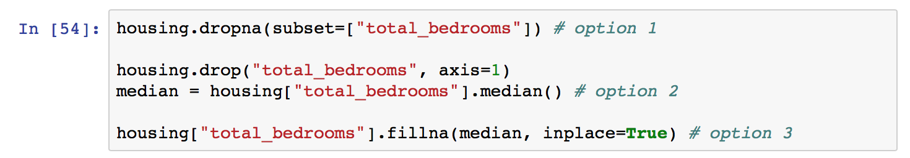

3개의 옵션을 골랐다면 training set의 평균값을 구한다 그리고 missing values에 채운다 그때, 중간 값을 저장하는것을 잊으면 안된다. 나중에 시스템을 평가할때 테스트 세트의 누락된 값을 바꿀 필요가 있고 시스템이 새 데이터의 누락 된 값을 대체하기 위해 다시 필요하다.

Scikit-Learn은 누락 된 값을 처리할 수 있는 편리한 클래스를 제공한다. 

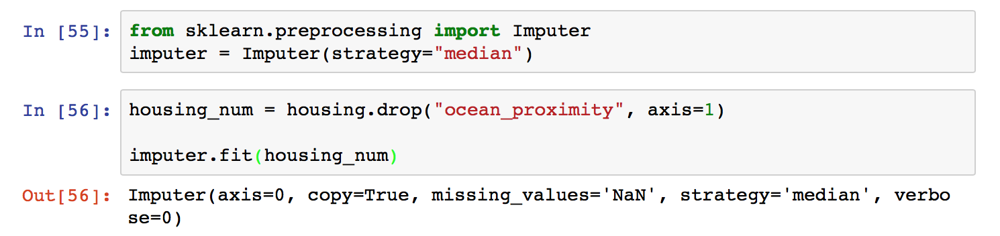

중앙값은 숫자 속성에만 계산할 수 있으므로 텍스트 속성없이 데이터 사본을 만들어야 한다. fit() 메서드를 사용해 imputer 인스턴스를 training data에 맞출 수 있다. 

imputer는 단순히 각 속성의 중앙값을 계산하고 그 결과를 인스턴스 변수에저장한다. total_bedrooms 속성만 누락 된 값을 가지지만 시스템이 실행 된 후에는 새 데이터에 누락 된 값이 없다는것을 확신 할 수 없기 때문에 모든 속성에 imputer를 한다.

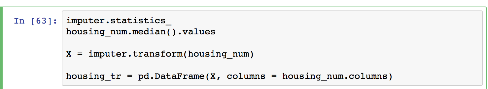

#### Handling Text and Categorical Attributes

이전에 ocean_proximity는 텍스트 속성이라 중간값을 계산할 수 없었다. 

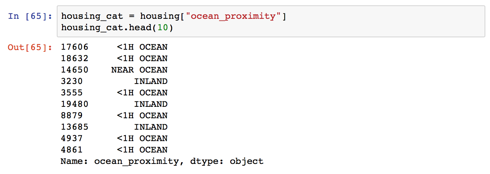

ML algorithms은 대부분 숫자에서 작업하므로 텍스트를 숫자로 변경한다. pandas 의 factorize() 메소드 사용

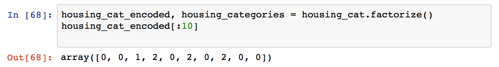

<1H OCEAN은 0으로 NEAR OCEAN은 1로 매핑

이렇게 매핑하면 다른 것들은 매핑 할 수 없어서 <1H OCEAN은 0으로 나머지 모두 1로 매핑 하는 것을 **One-hot Encoding** 이라고 한다.

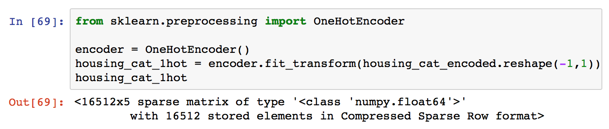

one-hot 인코딩후 수천개의 열이 있는 행렬을 얻는데 행 당 하나의 단일 행을 제외하고 0으로 채워진다. 이것은 메모리 낭비가 되므로 희소한 행렬은 0이 아닌 요소의 위치만 저장한다.

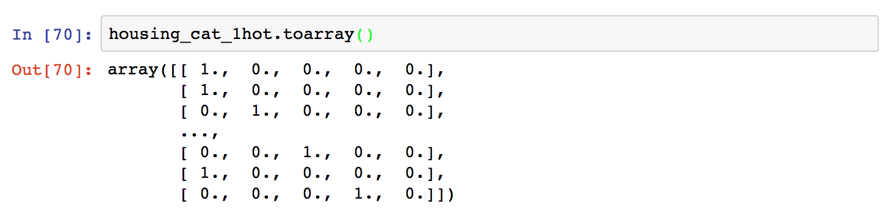

CategoricalEncoder 클래스를 사용하면 한번에 두가지 변형을 할수있다 ( 텍스트 -> 정수 -> one-hot )

#### Custom Transformers

Scikit-Learn은 많은 Transformers를 제공하지만 직접 작성해야한다. 클래스를 만들고 세 가지 방법을 구현한다. fit() , transform() , fit_transform()

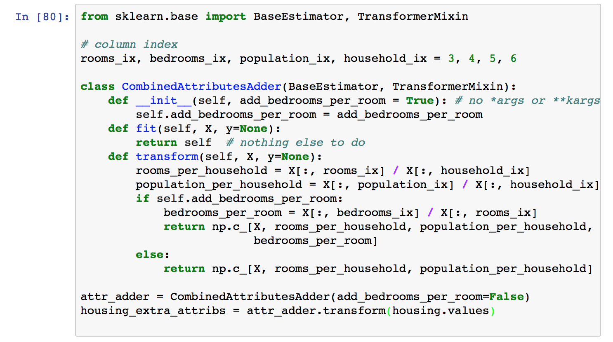

데이터에 적용해야하는 가장 중요한 변환 중 하나는 기능 확장이다. 모든 속성의 스케일을 동일하게 유지하는 두가지 일반적인 방법이 있다. 

* 최소 최대 스케일링

	최소값 스케일링은 간단하다. 값은 0~ 1 까지 범위에서 끝나도록 이동 및 재조정된다. 최소값을 빼고 최대 마이너스 값으로 나눔으로써 값을 구한다. Scikit-Learn은 이를 위해 MinMaxScaler라는 것을 제공한다. 
	
* 표준화

	표준화는 완전히 다르다. 먼저 평균 값을 뺀다. ( 표준화 된 값은 항상 0이다.) 그 다음 분산에 단위 분산이 있도록 분산으로 나눈다. 최소 최대 확장과달리 표준화는 값을 특정 범위로 한정하지 않으며 일부 알고리즘에서는 문제가 될수 있다. Scikit-Learn은 표준화를 위해 StandardScaler을 제공한다. 
	
#### Transformation Pipelines

데이터 변환은 올바른 순서로 실행해야하는데 이걸 도와주는 것인 pipeline 클래스가 있다. 
Scikit-Learn에서도 PipeLine클래스 존재

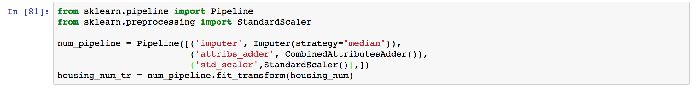

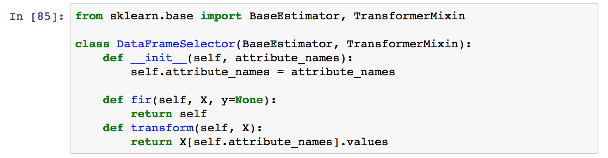

DataFrameSelector는 원하는 속성을 선택하고 나머지를 삭제하고 결과 DataFrame을 numpy배열로 변환하여 데이터를 변환한다. 이를 통해 pandas DataFrame을 사용하고 숫자 값만 처리하는 파이프 라인을 쉽게 작성할수 있다.

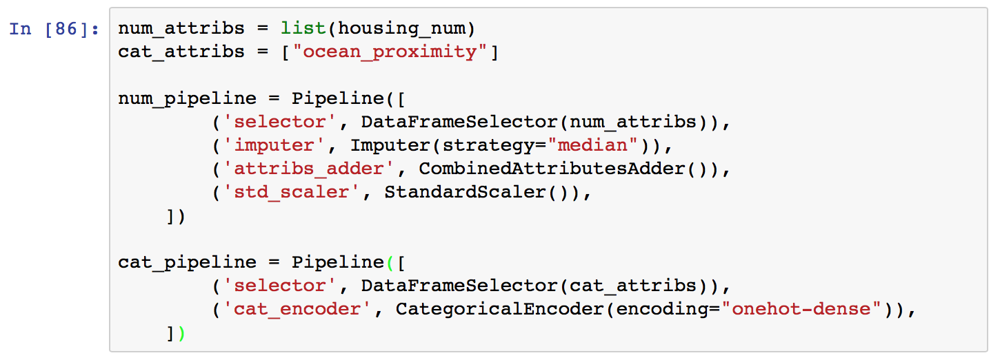

두 파이프 라인을 어떻게 하나의 파이프 라인에 결합 할까 Scikit-Learn의 FeatureUnion 클래스를 사용한다. 

## Select and Train a Model

이제 모델을 선택하고 교육 할 준비가 되었다.

#### Training and Evaluating on the Training Set

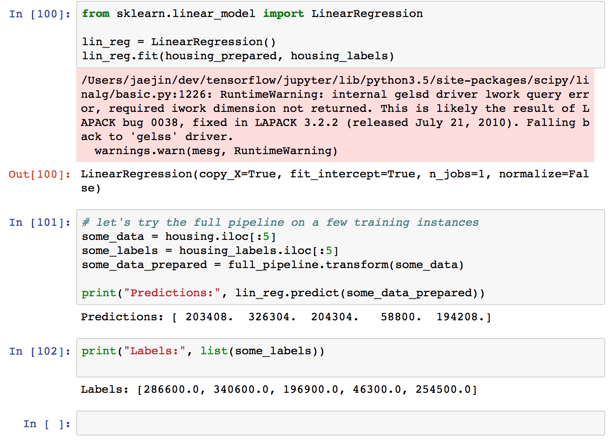

Linear Regression 모델을 훈련 해보자
예상치가 정확하진 않지만 작동은 한자 Scikit-Learn의 mean_squared_err 을 이용해 RMSE를 측정한다.

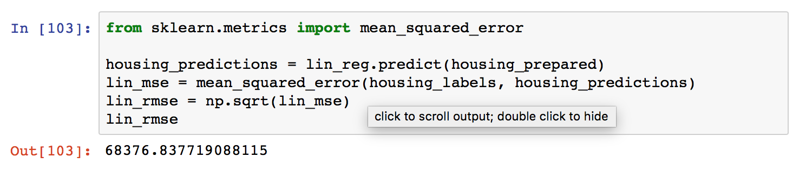

대부분 median_housing_values는 120,000에서 265,000 사이 이므로 68628은 만족스럽지 못하다. 따라서 모델이 강력하지 않다. 좀더 강력한 모델을 선택하거나 더 나은 알고리즘으로 사용해야한다. 

DecisionTreeRegresor를 훈련하면 

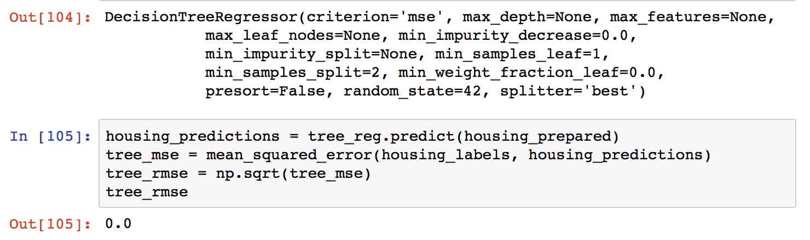

이 모델은 오버피팅이 된걸로 판단할 수 있다. 테스트 데이터를 가지고 테스트를 해봐야한다.

#### Better Evaluation Using Cross-Validation

DecisionTreeRegresor를 평가하는 방법은 데이터를 나누어서 training data 와 test data를 사용한다. 
다음 코드는 K-ford CV를 사용한다. 

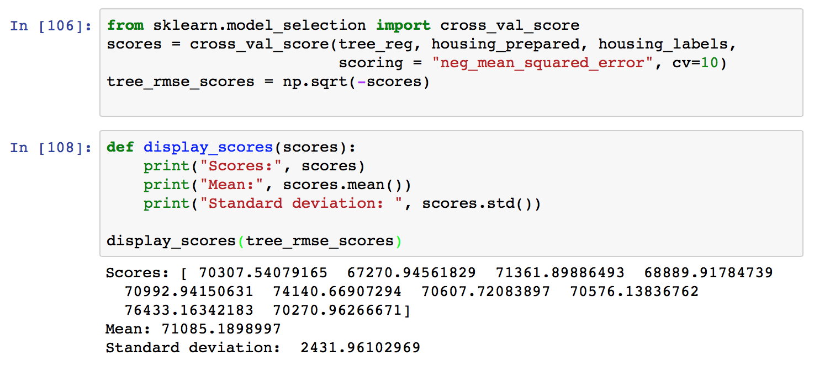

이전 처럼 DecisionTree가 훌륭하게 보이진 않는다. CV를 사용하면 모델 추정치, 정확성을 측정할 수 있다.

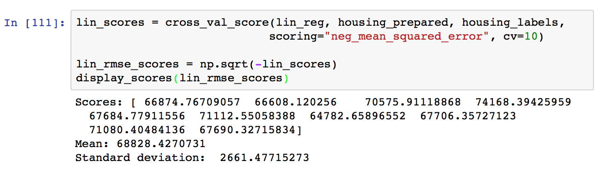

DecisionTree는 Linear Regression보다 성능이 좋지 않은만큼 잘 맞지 않는다. 마지막으로 RandomForestRegression을 사용하면 훨씬 좋게 나온다. 하지만 training set가 test set보다 훨씬 오류가 낮아서 training에 아직 오버 피팅이 되어있다. 
오버피팅의 해결책은 모델을 단순화 하거나 모델을 정규화 하거나 더 많은 교육 데이터와 dropout이 있다.

## Fine-Tune Your Model

이젠 훌륭한 모델이 있고 미세 조정하는 방법을 알아보자.

#### Grid Search

한가지 방법은 하이퍼 매개변수 값의 훌륭한 조합을 찾을때 까지 수동으로 하이퍼 매개변수를 사용하는 것이다. Scikit-Learn의 GridSearchCV를 사용하면 찾아준다.

#### Randomized Search

적은 수의 조합을 탐색 할때는 grid 방법이 좋지만 검색이 많은 경우 이 것을 사용하는게 좋다. 모든 반복에서 각 하이퍼 매개 변수의 임의 값을 선택해 임의의 조합 수를 계산한다. 

#### Ensemble Methods

시스템을 미세 조정하는 또다른방법은 가장 우수한 모델을 결함하는 것이다. 그룹( 앙상블 )은 특히 개별 모델이 매우 다른 유형의 오류를 만드는 경우 가장 적합한 개별모델보다 성능이 우수하다.

#### Analyze the Best Models and Their Errors

가장 좋은 모델을 검사하여 통찰력을 얻을수 있다. 이 정보를 사용하면 덜 유용한 기능 중 일부를 삭제할 수 있다.

#### Evaluate Your System on the Test set

모델을 조정한 후에는 테스트 세트로 최종 모델을 평가할 시간이다.

## Launch, Monitor, and Maintain Your System

모델이 새로운 데이터에 대해 저기적으로 교육을 받는 경우가 아니라면 모델은 시간이 지남에 따라 데이터가 진화하면서 부패하는 경향이 있기 때문에 시스템의 성능을 평가하려면 시스템의 예측을 샘플링하고 평가해야한다. 이건 인간의 분석이필요하다.

또한 시스템의 입력 데이터 품질을 평가해야한다. 일반적으로 새로운 데이터를 사용하여 정기적으로 모델을 교육하고 싶다. 가능한 프로세스를 자동화 해야한다. 그렇지않을경우 시스템 성능이 안좋아 질것이다.